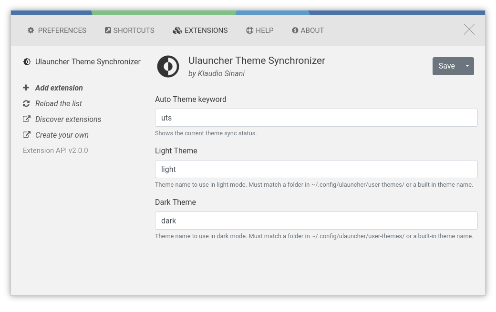

<div align="center">
  
</div>

<h1 align="center">
  Ulauncher Theme Synchronizer
</h1>

<h4 align="center">
  Synchronize Ulauncher with your OS appearance
</h4>

<div align="center">
  
</div>

## Description

Ulauncher Theme Synchronizer keeps your ULauncher theme consistent with the appearance of your desktop. It watches the operating system color scheme and the moment you switch between light or dark, swaps Ulauncher to the appropriate mode, thus avoiding a mismatched Ulauncher glowing white over your dark desktop.

In a nutshell, the extension observes the GNOME `color-scheme` setting from a background listener, resolves the target theme from your own preferences, writes it atomically to the Ulauncher settings file in order to prevent corruptions, and restarts Ulauncher to apply the change.

Use the `uts` query keyword at any moment to inspect the currently detected mode and the selected theme.

View the plugin on the official [Ulauncher extensions page](https://ext.ulauncher.io/-/github-klaudiosinani-ulauncher-theme-synchronizer).

You can now support the development process through [GitHub Sponsors](https://github.com/sponsors/klaudiosinani).

## Highlights

- Automatic light & dark theme switching
- Configurable theme mapping per OS mode
- Status view through keyword query `uts`
- Zero runtime dependencies beyond Ulauncher itself

## Contents

- [Description](#description)
- [Highlights](#highlights)
- [Requirements](#requirements)
- [Install](#install)
- [Usage](#usage)
- [Configuration](#configuration)
- [Flight Manual](#flight-manual)
- [Development](#development)
  - [Tasks](#tasks)
- [Team](#team)
- [License](#license)

## Requirements

- [Ulauncher](https://ulauncher.io) `5.x` - extension API version `2`
- Python `3.12`
- A desktop exposing the `org.gnome.desktop.interface` schema with the `color-scheme` key, i.e. GNOME `42+`

**Note:** The `color-scheme` key is the signal the extension listens to. At the moment **desktop environments** that **do not expose** it **are not supported**.

## Install

### Ulauncher

Open the Ulauncher preferences window, navigate to `Extensions` → `Add extension` and enter the following URL.

```
https://github.com/klaudiosinani/ulauncher-theme-synchronizer
```

### Manual

```bash
git clone https://github.com/klaudiosinani/ulauncher-theme-synchronizer \
  ~/.local/share/ulauncher/extensions/ulauncher-theme-synchronizer
```

Restart Ulauncher for the extension to be picked up.

```bash
pkill ulauncher && ulauncher --hide-window &
```

## Usage

```
uts

  Usage
    uts

    Description
      Display the currently detected operating system mode
      together with the Ulauncher theme selected for it.

    Preferences
      theme_kw         Keyword invoking the status view
      light_theme      Theme activated while in light mode
      dark_theme       Theme activated while in dark mode

    Examples
      uts
```

Beyond the status view the extension requires no interaction. Once installed it runs in the background and reacts to every operating system mode change on its own.

## Configuration

To configure the synchronizer open the Ulauncher preferences window, navigate to `Extensions > Ulauncher Theme Synchronizer` and modify any of the options to match your own preference.

The following illustrates all the available options with their respective default values.

| Option        | Type      | Default |
| :------------ | :-------- | :------ |
| `theme_kw`    | `Keyword` | `uts`   |
| `light_theme` | `String`  | `light` |
| `dark_theme`  | `String`  | `dark`  |

### In Detail

##### `theme_kw`

- Type: `Keyword`
- Default: `uts`

Keyword through which the status view is invoked from the Ulauncher input.

##### `light_theme`

- Type: `String`
- Default: `light`

Name of the theme activated while the operating system is in light mode.

The value must match either a built-in Ulauncher theme name or the name of a directory under `~/.config/ulauncher/user-themes/`.

##### `dark_theme`

- Type: `String`
- Default: `dark`

Name of the theme activated while the operating system is in dark mode.

The value must match either a built-in Ulauncher theme name or the name of a directory under `~/.config/ulauncher/user-themes/`.

## Flight Manual

The following is a minor walkthrough containing a set of examples on how to use the Ulauncher Theme Synchronizer.
In case you spotted an error or think that an example is not clear enough and should be further improved, please feel free to open an [issue](https://github.com/klaudiosinani/ulauncher-theme-synchronizer/issues/new/choose) or [pull request](https://github.com/klaudiosinani/ulauncher-theme-synchronizer/compare).

### Display Status

To inspect the currently detected Operating System mode along with the theme selected for it, invoke Ulauncher and type the configured keyword:

```
uts
```

The resulting item reports both values at once.

```
Theme Synchronizer
Active mode: dark - Selected theme: `ubuntu`
```

### Map Themes To Modes

Navigate to the extension preferences and set the `Light Theme` and `Dark Theme` fields to the names of the themes you wish to see in each mode:

```
Light Theme    adwaita
Dark Theme     ubuntu
```

The next operating system mode change will activate the corresponding theme.

### Switch The Operating System Mode

Toggling the desktop appearance is what drives the synchronizer. Under GNOME the mode is exposed through the `color-scheme` key and can be switched from the system settings, or directly from the command line, for example:

```bash
# activate the dark theme
gsettings set org.gnome.desktop.interface color-scheme prefer-dark
```

```bash
# activate the light theme
gsettings set org.gnome.desktop.interface color-scheme prefer-light
```

Any value containing `dark` is resolved as dark mode, while every remaining value, such as `default` and `prefer-light`, is resolved as light mode.

### Inspect The Active Theme

The activated theme is persisted under the `theme-name` property of your Ulauncher settings file, which is also the value reported by the status view.

```bash
cat ~/.config/ulauncher/settings.json | grep theme-name
```

## Development

For more info on how to contribute to the project, please open an [issue](https://github.com/klaudiosinani/ulauncher-theme-synchronizer/issues/new/choose) or [pull request](https://github.com/klaudiosinani/ulauncher-theme-synchronizer/compare).

- Fork the repository and clone it to your machine
- Navigate to your local fork: `cd ulauncher-theme-synchronizer`
- Create a virtual environment: `python3 -m venv .venv && source .venv/bin/activate`
- Install the development dependencies: `inv install` or `pip install -r requirements-dev.txt`
- Run the test suite: `inv test`
- Check the code for errors: `inv lint`
- Symlink the extension into Ulauncher: `inv link`
- Run Ulauncher in development mode: `inv dev --file-log`
- Tail the extension log file: `inv logs`
- Cleanup compiled files: `inv clean`

The test suite stubs the `gi` and `ulauncher` modules, hence neither Ulauncher nor PyGObject is required in order to run it.

### Tasks

All the available tasks, together with their aliases, are listed at any moment through `inv --list`, while `inv` on its own runs the default `test` task.

| Task     | Alias | Description                                                  |
| -------- |----- | ------------------------------------------------------------ |
| `install` | `i`  | Install the development dependencies                          |
| `test`   |      | Run the test suite                                            |
| `cov`    |      | Run the test suite with a coverage report                     |
| `lint`   |      | Check the code for errors                                     |
| `types`  |      | Check the code for type errors                                |
| `fix`    | `f`  | Format the code and automatically fix errors                  |
| `link`   | `l`  | Symlink the extension into the Ulauncher extensions directory |
| `unlink` |      | Remove the extension symlink                                  |
| `dev`    |      | Run Ulauncher in development mode                             |
| `logs`   |      | Tail the extension log file                                   |
| `restart` |      | Restart the Ulauncher process                                 |
| `kill`   | `k`  | Kill the Ulauncher process                                    |
| `clean`  |      | Clean up the compiled files and caches                        |

The `dev` task accepts the `--file-log`/`-f` flag, which enables debug file live logging for the extension by exporting the `ULAUNCHER_THEME_SYNCHRONIZER_FILE_LOG` variable. The resulting log file is the one read by `inv logs`.

```bash
inv dev --file-log
```

## Team

- Klaudio Sinani [(@klaudiosinani)](https://github.com/klaudiosinani)

## License

[MIT](license.md)
